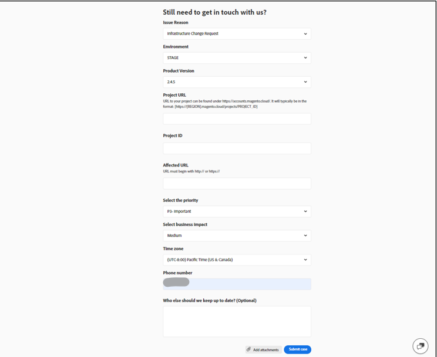
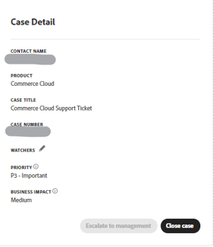

# 适用于Adobe Commerce的Experience League支持用户指南

在本指南中，了解如何向[Experience League支持](https://experienceleague.adobe.com/home#support)提交支持票证，并提供对Adobe Commerce帐户的共享访问权限。

>[!NOTE]
>
>Adobe Commerce支持已从Adobe Commerce帮助中心迁移到Experience League。 使用[此处](#what-is-experience-support)描述的Experience League案例表单流程提交支持案例。

>[!NOTE]
>
>目前，要查看您之前在Adobe Commerce帮助中心提交的案例，您必须转到https://support.magento.com/hc/en-us/requests ，因为这些案例尚未迁移到新的支持票证系统。 帮助中心现在为只读；要继续获得对原始问题的支持，您必须向[Experience League支持](https://experienceleague.adobe.com/home#support)提交跟进票证。

>[!NOTE]
>
>Adobe Commerce帮助中心的知识库部分已迁移到Adobe Experience League门户。 在创建支持工单时，将向您推荐相关的知识库文章，以及Adobe Experience League中的其他相关Adobe Commerce文档。

**主要更新：** 2024年7月29日

**[EXPERIENCE LEAGUE支持什么？](#what-is-experience-support)**

**[支持案例](#support-cases)**

* [登录到Experience League支持](#sign-in-experience-support)
* [提交支持案例](#submit-case)

   * [Adobe Experience League起始页](#experience-league-start-page)
   * [Adobe Commerce帐户页面](#submit-case-adobe-commerce-account-page)
   * [*请验证您的电子邮件地址*](#verify-email-address-error)

* [跟踪您的支持案例](#track-support-cases)
* [您案例中的备注](#comments-in-your-case)
* [结案](#close-case)
* [重新打开您的案例](#reopen-case)
* [使用Cloud Console提交票证](#cloud-console)
* [Adobe Commerce P1热线](#P1-hotline)
* [Adobe Commerce共同责任运营模式](#shared-responsibility-operational-model)

**[共享访问权限：授予其他用户访问您帐户的权限](#shared-access)**

* [谁可以提供共享访问权限](#who-can-provide-shared-access)
* [提供共享访问](#provide-shared-access)
* [撤销（删除）共享访问权限](#revoke-shared-access)

   * [如何删除通过Cloud项目被授予共享访问权限的用户？](#remove-cloud-shared-access-users)

* [访问共享帐户（切换帐户）](#switch-accounts)
* [共享访问疑难解答](#troubleshooting-shared-access)

**[ADOBE COMMERCE的计费常见问题解答](#billing-faq)**

## Experience League支持什么？ {#what-is-experience-support}

Experience League支持是Adobe的支持门户，符合条件的Adobe Commerce客户可以在这里提交和管理支持工单。 您还可以在该处查看故障排除文章。

## 支持案例 {#support-cases}

Adobe Experience League支持案例管理允许通过案例与支持人员合作，解决在根据合同为所有Adobe产品使用Adobe Commerce等Adobe Commerce产品时遇到的特定问题。

## 登录EXPERIENCE LEAGUE支持 {#sign-in-experience-support}

登录允许您提交、更新和响应工程师有关支持票证的问题。

要登录Adobe Experience League支持，请执行以下步骤：

1. 导航到[experienceleague.adobe.com](https://experienceleague.adobe.com/)。
1. 使用您的Adobe登录凭据登录。

### 提交支持案例 {#support-case}

以帐户所有者或Shared Access用户身份成功登录后，您可以使用Adobe Experience League主页、Adobe Commerce帐户页面和Adobe Commerce Cloud帐户页面提交支持案例。

>[!NOTE]
>
>Adobe Commerce Marketplace团队的支持请求无法通过Experience League提交，因为其支持系统在未与Experience League集成的单独平台上运行。
>
>如果以下陈述属实，您可以提交支持案例：
>
>* 有问题的组织在左列中命名，以([!DNL Commerce])结尾。 您的问题与该组织或与其关联的帐户相关。
>* 您的问题是无法登录Marketplace帐户，或者对于部署扩展有疑问。
>* 您提出的问题不仅仅是为所购买的Marketplace产品申请退款。
>
>对于与发布扩展、在购买过程中遇到问题或在[Adobe Commerce Marketplace](https://commercemarketplace.adobe.com/)中请求退款相关的问题，您必须直接访问https://commercemarketplace.adobe.com/以联系[!DNL Commerce Marketplace]团队。 导航到页面底部并单击&#x200B;**[!UICONTROL Contact Us]**，这将打开一个表单以提交Marketplace支持票证。

#### Adobe Experience League起始页 {#experience-league-start-page}

要使用Adobe Experience League的起始页提交新的支持案例，请执行以下步骤：

>[!INFO]
>
>1. 要提交案例，您必须有权支持相应的产品(例如，Adobe Commerce、Adobe Commerce Intelligence、Adobe Commerce支付服务、Experience Platform等)。 如果您无权获得支持，页面顶部将显示一个栏，告知您您您不是组织中有权获得支持的用户。
>1. 如果您属于多个组织，或者有多个组织具有相似的名称(每个组织都表示该组织订阅的任何其他Adobe产品)，则需要首先从左列（以&#x200B;*[!DNL (Commerce)]*&#x200B;结尾）的下拉菜单中选择相应的组织。
>1. 提交与Adobe Commerce相关的案例时，如果您在[!UICONTROL Select a product]下拉列表中未看到Commerce，则必须首先从Commerce帐户所有者获取[共享访问权限](#shared-access)。

>[!NOTE]
>
>在提交案例之前，请确保您选择了正确的组织，并且您选择的组织拥有您请求支持的产品的相应权利。 例如，如果您的问题与Adobe Commerce有关，但您选择了Adobe Commerce Intelligence或Adobe Experience Platform作为产品，并且案例已成功提交，这可能会导致案例的路由错误和响应时间的延迟。
>
>此外，如果在提交案例时选择了错误的组织，您的团队将无法在[!UICONTROL My Cases]下查看相应/正确的组织案例。 Adobe Commerce支持团队无法更改与案例关联的组织；要解决此问题，您必须关闭现有案例，并提交包含提供/选择的相应详细信息的新案例。

1. 单击标题中的&#x200B;**支持**。 打开“支持”主页。

   

1. 要开始支持接收流程，请确保您从“组织”下拉列表（如果可见）中选择了相应的组织。 要提交Adobe Commerce案例，请选择以&#x200B;*[!DNL Commerce]*&#x200B;结尾的组织名称。

   

1. 单击左侧菜单中的&#x200B;**[!UICONTROL Open Ticket]**&#x200B;或单击&#x200B;*[!UICONTROL Open a support ticket]*&#x200B;卡片中的&#x200B;**[!UICONTROL Get Started]**。

   

1. 从下拉菜单中选择产品，并提供案例标题和描述。 注意：如果下拉列表未显示任何产品或[!DNL Commerce]不是可用选项，请尝试切换左列中的[!UICONTROL Organization]并再次检查。

   

   >[!NOTE]
   >
   >如果您在云基础架构&#x200B;**上提交一个带有“**[!DNL Commerce]”的票证作为产品，并且组织列出了多个项目，则将提示您选择适当的[!UICONTROL Project ID]。 如果找不到所需的[!UICONTROL Project ID]，请确保在票证上添加一条注释，说明您正在为其他“项目X”寻求帮助。 如果您打算在Managed Services **”票证上提交“**[!DNL Commerce]”，并且在&#x200B;**[!DNL Commerce]上云基础架构**，但在云基础架构&#x200B;**上看不到**[!DNL Commerce]&#x200B;是可用的产品： 1。 在&#x200B;**[!UICONTROL Case title]**&#x200B;中输入问题的主题。 2。 在&#x200B;**[!UICONTROL Case description]**&#x200B;中输入问题的描述。 3。 输入这两个项目后，将显示下面的&#x200B;**[!UICONTROL Cloud Project URL]**&#x200B;字段。

1. Adobe Experience League将推荐可帮助您解决案例的文章和最佳实践。 如果您仍然需要直接支持，则在提交案例之前需要提供一些其他信息。

   

1. 填写完所有必需的信息后，单击&#x200B;**[!UICONTROL Submit case]**。

>[!IMPORTANT]
>
>如果您在登录experienceleague.adobe.com时无法在组织下拉菜单中看到您的组织，则在请求支持或管理现有支持案例之前，可能需要将您的配置文件与accounts.magento.com同步。
>
>1. 导航到accounts.magento.com ，然后使用您将用于管理Adobe Experience League中的支持案例的相同配置文件（企业、学校或个人）登录。
>1. 成功登录accounts.magento.com配置文件后，请导航回experienceleague.adobe.com并登录。
>1. 从组织下拉菜单中选择您的组织。
>1. 如果贵组织仍未出现，请联系Commerce管理员以获取支持委派权限。 有关其他信息，请参阅[Commerce帐户共享](https://experienceleague.adobe.com/en/docs/commerce-admin/start/commerce-account/commerce-account-share)帮助文章。

>[!NOTE]
>
>为什么组织/产品很重要
>
>**示例A**：您仅共享了对一家公司的访问权限，该公司拥有两个Adobe产品的权利：Product1和Product2。
>
>1. 由于每个组织代表一种产品，因此您会在下拉列表中看到两个组织，例如OrgA-Product1和OrgB-Product2。
>1. 如果您选择了产品= Product1，但您的问题与Product2有关，则案例将被转接至Product2支持部门，在将案例转接至Product1支持部门时会有所延迟。
>1. 如果您提交了OrgA-Product1的案例，并且希望将来查看该组织的[!UICONTROL My Cases]，那么如果选择OrgA-Product2作为组织，您将不会看到该案例（与示例B相比，您只需选择另一个组织）。
>
>**示例B**：您已共享对两家公司的访问权限，并且每家公司只拥有Adobe Commerce的权利。
>
>1. 如果您为OrgA提交了案例，但问题实际影响OrgB，则OrgB的成员将来将无法在[!UICONTROL My Cases]下看到此案例。
>1. 此外，OrgA成员将能够查看[!UICONTROL My Cases]下实际适用于OrgB的案例，这可能会导致隐私问题。

您必须同时在https://account.adobe.com和https://account.magento.com拥有帐户才能登录Experience League以提交支持案例。 在登录之前，您将无法提交支持案例。

>[!NOTE]
>
>如果您已在https://account.magento.com上拥有帐户，但无法登录，则可能尚未在https://account.adobe.com上注册帐户（自2022年8月起，必须注册）。
>
>要解决此问题：
>
>1. 在https://account.adobe.com上使用与您的广告ID相同的电子邮件地址创建一个帐户。
>1. 转到https://account.magento.com ，将您的Adobe ID与MAG ID关联起来。

#### Adobe Commerce帐户页面 {#submit-case-adobe-commerce-account-page}

要使用Adobe Commerce帐户页提交新的支持工单，请执行以下步骤：

1. 登录到您的Adobe Commerce帐户。 请参阅我们的用户指南中的[详细说明](https://experienceleague.adobe.com/docs/commerce-admin/start/commerce-account/commerce-account-create.html?lang=en#create-a-commerce-account)。
1. 单击&#x200B;**支持**&#x200B;选项卡。

   {width="800"}

1. 系统会为您加载Adobe Experience League支持页面。
1. 从左侧菜单中选择&#x200B;**[!UICONTROL Open Ticket]**。
1. 填写字段。
1. 单击&#x200B;**提交**。

#### *请在Adobe Commerce帐户页面上验证您的电子邮件地址*&#x200B;错误 {#verify-email-address-error}

如果您收到“请验证您的电子邮件地址”错误(类似于[Adobe Commerce帐户](https://account.magento.com/)页面上的以下错误)，您将无法提交支持票证。

### 跟踪您的支持案例 {#track-support-case}

您的支持案例包括：

* 已经亲自提交了。
* 已通过CC（抄送）添加到作为观察者。

#### 查看您的案例

您可以单击左侧菜单中的&#x200B;**[!UICONTROL My Cases]**&#x200B;查看您本人提交的案例。 确保您选择了以“(Commerce)”结尾的正确组织。

#### 从Adobe Commerce帮助中心查看历史案例

详细了解如何从Adobe Commerce知识库的[停用Adobe Commerce帮助中心](https://experienceleague.adobe.com/en/docs/commerce-knowledge-base/kb/announcements/news/decommissioning-of-adobe-commerce-help-center)中的Adobe Commerce帮助中心&#x200B;**查看您的历史案例**。

#### 查看您的观察案例

通过单击左侧菜单上的&#x200B;**[!UICONTROL My organization's cases]**，您可以查看&#x200B;*添加为观察者的案例*。

<!-- TODO: Add image here -->

#### 搜索案例

若要查找案例，请在&#x200B;*[!UICONTROL Search]*&#x200B;字段中键入搜索查询，然后在键盘上按&#x200B;*Enter*。

#### 升级您的案例

如果您认为某个案例需要进一步关注，并且我们的初始响应时间已过，您可以升级该案例。 要做到这一点，

1. 单击屏幕右侧&#x200B;*[!UICONTROL Case Detail]*&#x200B;面板右下角的&#x200B;**[!UICONTROL Escalate to management]**。

   

1. 单击后，将显示一个弹出表单。 填写表单，然后单击&#x200B;**[!UICONTROL Escalate]**。

   

   *升级原因可能包括*：代理沟通技能、代理技术知识、等待回叫/更新、问题紧迫性更改、解决未达到预期或解决时间。

#### 在支持案例中添加观察程序

您可以添加观察者来支持组织成员提交的案例。 当提交新案例或更新现有案例时，观察者将收到电子邮件通知。

1. 要将观察程序添加到现有案例，请打开案例，然后单击屏幕右侧“案例详细信息”面板中“观察程序”旁边的铅笔图标。

   

1. 单击铅笔后，您可以在列表中添加或删除观察者。

   

### 您案例中的备注 {#comments-in-your-case}

您案例中的注释包含您或Adobe Commerce支持团队编写的所有注释。 注释按最新（顶部）到最早（底部）顺序显示。
要添加评论，请执行以下步骤：

1. 滚动到票证的底部。
1. 将您的评论写入&#x200B;**[!UICONTROL Comments]**&#x200B;字段，然后单击&#x200B;**[!UICONTROL Add comments]**。

### 结案 {#close-case}

要关闭您的案例，请单击&#x200B;*[!UICONTROL Case Detail]*&#x200B;面板右下角的&#x200B;**[!UICONTROL Close case]**。

### 重新打开您的案例 {#reopen-case}

要重新打开您的案例，请回复我们的支持系统中与该案例相关的电子邮件，并请工程师重新打开该案例。 如果您在案例关闭后14天内执行此操作，工程师可以为您重新打开案例。 但是，如果是在14天之后，工程师必须创建一个新案例。

### 使用Cloud Console提交票证 {#cloud-console}

要使用Cloud Console提交新的支持工单，请执行以下步骤：

1. 登录到[云控制台](https://console.adobecommerce.com)。
1. 在用户菜单中选择&#x200B;**[!UICONTROL Support]**。
1. 加载&#x200B;**[!UICONTROL My Tickets]**&#x200B;页面。
1. 单击右上角的&#x200B;**[!UICONTROL Submit a ticket]**。
1. 填写字段。
1. 单击&#x200B;**提交**。
1. 单击&#x200B;**[!UICONTROL Submit]**。

### Adobe Commerce P1热线 {#P1-hotline}

[Adobe Commerce P1热线](https://experienceleague.adobe.com/docs/commerce-knowledge-base/kb/how-to/adobe-commerce-p1-notification-hotline.html)文章提供了Adobe Commerce在P1事件期间寻求帮助时的P1热线号码，并解释了要提供的信息。

### Adobe Commerce共同责任运营模式 {#shared-responsibility-operational-model}

请参阅关于[Adobe Commerce分担责任运营模型](https://experienceleague.adobe.com/en/docs/commerce-operations/security-and-compliance/shared-responsibility#operational-responsibilities-summary)的文章，
旨在厘清我们专业基础设施服务的运营责任。

### 打开跟进票证 {#follow-up}

打开跟进票证将确保原始问题链接到跟进票证以实现连续性。

要打开跟进票证，请单击您要创建跟进的票证底部的“*创建跟进*”链接。

## 共享访问：授予其他用户访问您帐户的权限 {#shared-access}

您可以为其他Adobe Commerce帐户持有人授予对您帐户的有限访问权限。 特别是，使用&#x200B;**共享访问**&#x200B;功能，您可以为受信任的员工和服务提供商提供使用帮助中心帐户的权限，以便他们可以使用您的支持票证。

您可以使用位于[https://account.magento.com](https://account.magento.com/)的Adobe Commerce帐户页提供和管理共享访问权限。

### 谁可以提供共享访问权限 {#who-can-provide-shared-access}

只有具有相应权限的帐户所有者（主帐户所有者）才能为其他用户提供共享访问权限。

管理用户及其访问权限是客户的责任，在共享访问方面尤其如此。 因此，Adobe Commerce支持团队无法代表客户提供对Adobe Commerce帐户的共享访问权限。 建议客户使用[Adobe Commerce帐户页面](https://account.magento.com/)自行添加具有共享访问权限的用户。

已被提供共享访问权限的用户不能向其他用户转移或授予此类访问权限。

### 提供共享访问 {#provide-shared-access}

有关设置共享帐户的详细步骤，请参阅Adobe Commerce快速入门指南的[共享Commerce帐户](https://experienceleague.adobe.com/en/docs/commerce-admin/start/commerce-account/commerce-account-share)部分。

>[!NOTE]
>
>在授予用户共享访问权限之前，该用户必须具有现有帐户 — 有关更多详细信息，请参阅[创建Commerce帐户](https://experienceleague.adobe.com/en/docs/commerce-admin/start/commerce-account/commerce-account-create#create-a-commerce-account)。

为新用户提供共享访问后，相关信息可在您的Adobe Commerce帐户页面的&#x200B;**共享访问** > **管理权限**&#x200B;中获得。

### 撤销（删除）共享访问权限 {#revoke-shared-access}

1. 在[https://account.magento.com](https://account.magento.com/)登录到您的Adobe Commerce帐户。
1. 在左侧面板中的“共享访问”下，选择&#x200B;**管理权限。**
1. 找到要撤销其共享访问权限的用户，然后单击用户行（**操作**&#x200B;列）中的{width="25"}。
1. 单击&#x200B;**删除用户**&#x200B;以撤销访问权限，或者单击X在顶角取消撤销。

   {width="800"}

   您还可以使用&#x200B;**编辑**&#x200B;菜单撤销共享访问权限：

1. 在[https://account.magento.com](https://account.magento.com/)登录到您的Adobe Commerce帐户。
1. 在左侧面板中的“共享访问”下，选择&#x200B;**管理权限。**
1. 找到要撤销其共享访问权限的用户，然后单击用户行（**操作**&#x200B;列）中的&#x200B;**编辑**。
1. 单击页面底部的&#x200B;**删除此用户**。
1. 在确认弹出窗口中，单击&#x200B;**删除用户**&#x200B;以撤销访问权限，或者单击顶角的X以取消撤销。

### 如何删除通过Cloud项目被授予共享访问权限的用户？ {#remove-cloud-shared-access-users}

<u>受影响的产品和版本</u>

* Adobe Commerce Cloud（所有版本）

<u>原因</u>

如果您拥有Adobe Commerce Cloud项目并且在该项目中添加了用户，则他们可能已自动获得对项目所有者的图像ID的共享访问权限。 这通常显示在&#x200B;**[!UICONTROL Share Name]**&#x200B;列中，显示来自MAG[XYZ ]*的*&#x200B;云共享访问。

>[!NOTE]
>
>如果缺少DELETE链接，则表示通过Commerce Cloud自动授予共享访问权限。

<u>解决方案</u>

如果未在此页面](https://account.magento.com/grantor/manage/)上添加/给定[，则无法从MAG[XYZ ]*中删除共享名称为* Cloud Shared Access的共享访问用户列表。 保留它们是为了提供信息/进行审核。

但是，一旦您撤销了这些共享访问用户的权限，他们将不再拥有该访问权限。

1. 在[https://account.magento.com](https://account.magento.com/)登录到您的Adobe Commerce帐户。
1. 在左侧面板的&#x200B;*[!UICONTROL Shared Access]*&#x200B;下，选择&#x200B;**[!UICONTROL Manage Permissions]**。
1. 找到要撤销其共享访问权限的用户，然后单击用户行（*[!UICONTROL Actions]*&#x200B;列）中的&#x200B;**[!UICONTROL Edit]**。
1. 取消选中&#x200B;*[!UICONTROL Grant Account Permissions]*&#x200B;下的所有资源。

{width="800"}

有关更多信息，请参阅我们的Commerce on Cloud Infrastructure指南上的[管理用户访问权限](https://experienceleague.adobe.com/docs/commerce-cloud-service/user-guide/project/user-access.html#manage-users-from-the-project-web-interface)文档。

### 访问共享帐户（切换帐户） {#switch-accounts}

要使用为您提供的共享访问权限，请执行以下步骤：

1. 在[https://account.magento.com](https://account.magento.com/)登录到您的Adobe Commerce帐户。
1. 单击&#x200B;**切换帐户**&#x200B;菜单并选择帐户。

   {width="800"}

要了解您当前使用哪个帐户（您自己的本机帐户或共享访问权限），请参阅&#x200B;**切换帐户**&#x200B;菜单：该菜单显示活动帐户。

### 共享访问疑难解答 {#troubleshooting-shared-access}

请参阅我们的支持知识库中的[共享访问疑难解答文章](/help/troubleshooting/miscellaneous/shared-access-troubleshooting.md)。

## Adobe Commerce的计费常见问题解答 {#billing-faq}

商家通常通过信用卡(CC)交易来支付我们的服务，此[Adobe Commerce帐单常见问题解答](/help/faq/general/billing-faq-for-adobe-commerce.md)是在您支付账单时提供帮助的资源。

